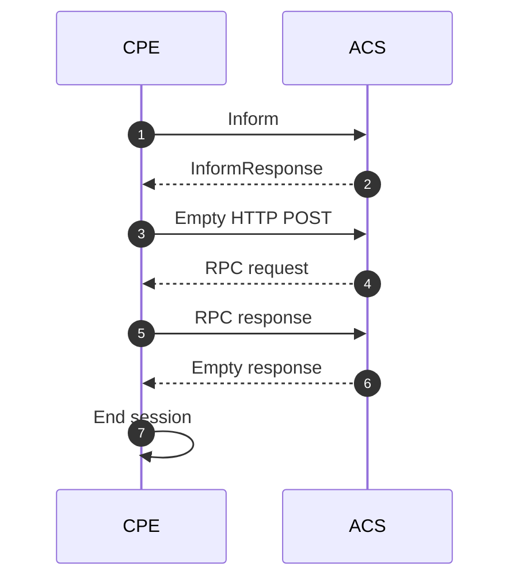
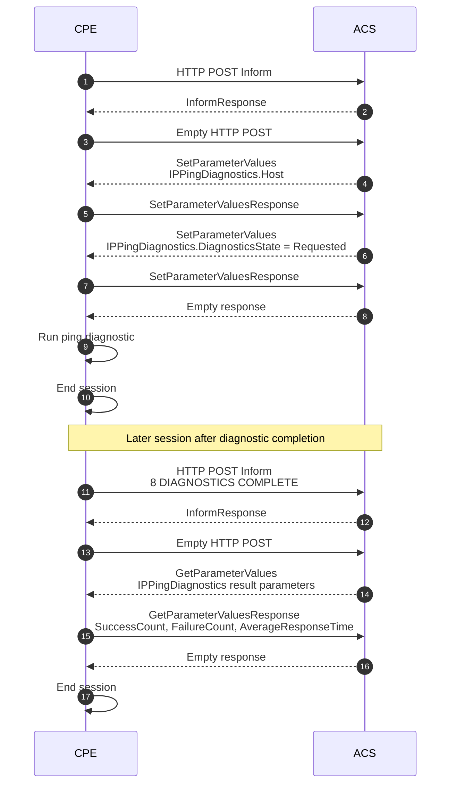
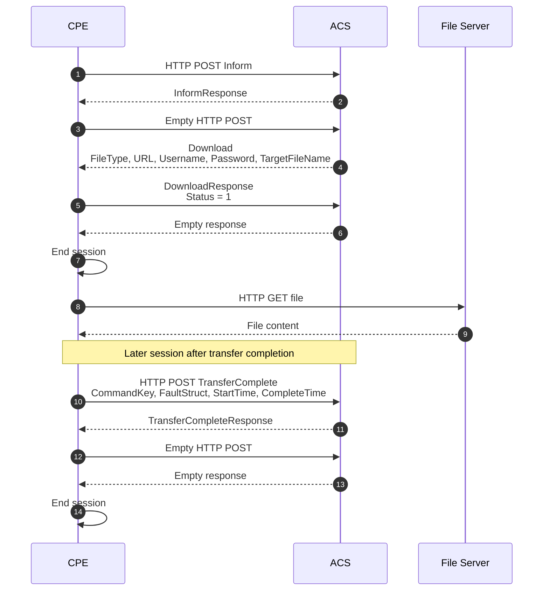

# cwmp-sim

[](https://www.npmjs.com/package/cwmp-sim)
[](https://www.npmjs.com/package/cwmp-sim)
[](LICENSE)

A TypeScript CWMP/TR-069 CPE simulator for testing ACS sessions, SOAP RPC flows, Digest authentication, diagnostics, file transfers, and Connection Request handling.

> Published on npm as [`cwmp-sim`](https://www.npmjs.com/package/cwmp-sim).
> Run it as a CLI with `npx cwmp-sim`, or clone the repo to develop.
> Zero runtime dependencies — Node.js `>=22` only.

## What This Project Is

`cwmp-sim` is a developer-oriented CWMP (CPE WAN Management Protocol) simulator.

It is designed to help:

- Test ACS provisioning logic.
- Debug CWMP SOAP/XML request and response payloads.
- Reproduce CPE session behavior.
- Validate ACS handling of CPE-initiated sessions.
- Test Connection Request flows.
- Exercise parameter reads and writes.
- Simulate diagnostics and transfer completion events.
- Experiment with TR-098/TR-181-like data models.

## What This Project Is Not

This project is not a complete router firmware, not a real CPE implementation, and not a CWMP/TR-069 certification suite.

It implements a practical subset of CWMP/TR-069 behavior for ACS testing, protocol development, and debugging.

## Overview

`cwmp-sim` simulates a CPE (Customer Premises Equipment) talking to an ACS (Auto Configuration Server) over CWMP/TR-069. It starts a local Connection Request server, sends `Inform` messages to the ACS, processes SOAP RPCs from the ACS, updates an in-memory device data model, and can trigger follow-up sessions for events such as diagnostics completion, transfer completion, reboot, factory reset, and connection requests.

The project is intentionally small and uses native Node.js networking/XML helpers for the runtime path. It is written in TypeScript and uses TypeScript tooling for development.

## What It Supports

### CWMP session behavior

- Initial `1 BOOT` inform on startup.
- Periodic inform scheduling after idle/end-of-session responses.
- ACS-driven RPC request/response loop.
- Empty HTTP POST handling during the CWMP session.
- ACS empty response / HTTP `204` handling as end of session.
- CPE-originated follow-up events:
  - `2 PERIODIC`
  - `6 CONNECTION REQUEST`
  - `7 TRANSFER COMPLETE`
  - `8 DIAGNOSTICS COMPLETE`
  - `M Reboot`
  - `M Download`
  - `M Upload`

### ACS HTTP client

- HTTP and HTTPS ACS URLs.
- Keep-alive session transport.
- Basic authentication.
- Digest authentication retry after ACS `401` challenge.
- Cookie forwarding from `Set-Cookie` during Digest retry.
- SOAP request generation and response parsing.

### Connection Requests

- Local Connection Request listener, default port `7547`.
- HTTP listener by default.
- Digest authentication by default when credentials are configured.
- Basic authentication when configured through connection options.
- Valid requests trigger a new CWMP session with `6 CONNECTION REQUEST`.
- `Device.ManagementServer.ConnectionRequestURL` is updated from the listener address.

### Data models

The simulator keeps an in-memory CPE parameter tree. Leaf parameters follow this internal shape:

```ts
{
  _value: string;
  _type: string;
  _writable: boolean;
}
```

The simulator can use either root object:

```text
Device
```

or:

```text
InternetGatewayDevice
```

Built-in model areas include:

- `DeviceInfo`
- `ManagementServer`
- WAN IP connection parameters
- WLAN configuration parameters
- port mapping objects
- IP ping diagnostics
- traceroute diagnostics
- download diagnostics
- upload diagnostics

Model fixtures are available under `models/`, including JSON and CSV files.

### Supported RPC methods

The simulator advertises and handles these ACS RPCs:

- `GetRPCMethods`
- `InformResponse`
- `GetParameterValues`
- `GetParameterNames`
- `SetParameterValues`
- `SetParameterAttributes`
- `GetParameterAttributes`
- `AddObject`
- `DeleteObject`
- `Download`
- `Upload`
- `Reboot`
- `FactoryReset`
- `ScheduleInform`
- `GetQueuedTransfers`
- `GetAllQueuedTransfers`
- `ScheduleDownload`
- `CancelTransfer`
- `TransferCompleteResponse`

Unsupported RPCs return a CWMP `9000 Method not supported` fault.

## CWMP Session Flow

A typical CWMP session follows this flow:



The simulator repeats the ACS RPC request and CPE RPC response part of the flow until the ACS ends the session with an empty response or HTTP `204`.

## Diagnostics

The simulator includes task-based diagnostic behavior. Diagnostics are triggered when the ACS sets the corresponding `DiagnosticsState` parameter to `Requested`:

Supported diagnostic areas include:

- IP ping
- traceroute
- download diagnostics
- upload diagnostics
- neighboring Wi-Fi diagnostics

When a diagnostic finishes, the simulator can trigger a new inform session with `8 DIAGNOSTICS COMPLETE`:



## Transfers

The simulator supports transfer-style tasks for CWMP `Download` and `Upload` RPCs.

* `Download` performs an HTTP/HTTPS `GET` against the requested URL.
* `Upload` performs an HTTP/HTTPS `PUT` to the requested URL.
* Transfer tasks queue a `TransferComplete` RPC after completion or failure.
* Delayed transfer execution is supported through `DelaySeconds` for immediate `Download`/`Upload` tasks.
* Queued transfer inspection is available through `GetQueuedTransfers` and `GetAllQueuedTransfers`.

Transfer tasks can produce completion events such as:

```text
7 TRANSFER COMPLETE; M Download
7 TRANSFER COMPLETE; M Upload
```

Or a more advanced asynchronous download flow:



This allows an ACS to test asynchronous transfer workflows, including delayed execution, successful transfers, failed transfers, and later `TransferComplete` reporting.

## Requirements

- Node.js `>=22` (the entrypoints run as native TypeScript; the `dev` script uses `tsx`).
- Development dependencies from `package.json`:
  - `typescript`
  - `tsx`
  - `@types/node`

Runtime code is built on native Node.js modules such as `http`, `https`, `net`, `crypto`, `fs`, and `child_process`. There are no runtime dependencies.

## Installation & Usage

There are two ways to run `cwmp-sim`: install it from npm to use it as a tool, or clone the repo to develop it.

### Option A — From npm (use it as a CLI)

Run it directly without installing:

```bash
npx cwmp-sim --acs http://your-acs:7547/ --serial SIM001
```

Or install it globally and run the `cwmp-sim` command:

```bash
npm install -g cwmp-sim
cwmp-sim --acs http://your-acs:7547/ --serial SIM001
```

The npm CLI is configured via [CLI options](#cli-options) and/or [environment variables](#environment-variables)
(`ACS_URL`, `ACS_USER`, `DEVICE_SERIAL`, …) exported in your shell. To load settings from a `.env`
file instead, run the binary through Node's `--env-file`:

```bash
node --env-file=.env "$(npm root -g)/cwmp-sim/dist/main.js"
```

### Option B — From source (development)

```bash
git clone https://github.com/softov/cwmp-sim.git
cd cwmp-sim
npm install
cp .env.example .env   # then edit .env for your ACS
```

Then use the npm scripts:

| Command | What it does |
| --- | --- |
| `npm run dev` | Run `main.ts` directly via `tsx`, loading `.env`. |
| `npm run build` | Compile TypeScript to `dist/`. |
| `npm start` | Run the compiled build: `node --env-file=.env ./dist/main.js`. |
| `npm run check` | Type-check only (`tsc --noEmit`). |
| `npm test` | Run the unit suite (`test/**/*.test.ts`). |

CLI flags can be passed through the scripts with `--`, e.g.:

```bash
npm run dev -- --acs http://your-acs:7547/ --serial SIM001
```

## Configuration

Configuration can be provided through environment variables (see `.env.example`) and a small CLI parser.

### Environment variables

| Variable | Description | Default |
| --- | --- | --- |
| `ACS_URL` | ACS endpoint URL | `http://localhost:7547/` |
| `ACS_USER` | ACS username | empty |
| `ACS_PASS` | ACS password | empty |
| `CONN_ADDR` | Connection Request bind address | `0.0.0.0` |
| `CONN_PORT` | Connection Request port | `7547` |
| `CONN_USER` | Connection Request username | empty |
| `CONN_PASS` | Connection Request password | empty |
| `DEVICE_ROOT` | Root model name: `Device` or `InternetGatewayDevice` | `Device` |
| `DEVICE_SERIAL` | Device serial number | `123456` |
| `DEVICE_OUI` | Device OUI | `000000` |
| `DEVICE_PRODUCT_CLASS` | Product class | `Simulator` |
| `DEVICE_CSV` | CSV path used by the current placeholder export hook | `./models/data_model_test.csv` |
| `DEVICE_JSON` | Optional JSON data-model fixture overlaid on the default tree (skipped if missing) | `./models/data_model_tests.json` |

### CLI options

```bash
npm run dev -- --acs http://acs.example.test:7547/acs --ip 0.0.0.0 --port 7547 --serial SIM001
```

Supported CLI flags:

- `--acs <url>`
- `--ip <address>`
- `--port <port>`
- `--serial <serial>`

## Project Structure

```text
cwmp-sim/
├─ main.ts                 # Entrypoint, env config, and CLI parsing
├─ models/                 # Model fixtures
├─ src/
│  ├─ cwmp-sim.ts          # Main simulator orchestrator and session lifecycle
│  ├─ cwmp-device.ts       # In-memory CPE data model, state, events, and task queue
│  ├─ cwmp-conn.ts         # Connection Request HTTP server
│  ├─ cwmp-http.ts         # HTTP/HTTPS client with Digest auth and cookie handling
│  ├─ cwmp-methods.ts      # CWMP RPC method implementations
│  ├─ cwmp-soap.ts         # SOAP envelope helpers and CWMP request extraction
│  ├─ cwmp-model.ts        # Default data model helpers and parameter structures
│  ├─ cwmp-task.ts         # Base class for diagnostics and transfer tasks
│  ├─ diag-ping.ts         # IPPing diagnostics
│  ├─ diag-traceroute.ts   # TraceRoute diagnostics
│  ├─ diag-download.ts     # Download diagnostics
│  ├─ diag-upload.ts       # Upload diagnostics
│  ├─ diag-wifi.ts         # Neighboring Wi-Fi diagnostics
│  ├─ task-download.ts     # Download RPC transfer task
│  ├─ task-upload.ts       # Upload RPC transfer task
│  ├─ xml-parser.ts        # Lightweight XML parser
│  ├─ xml-utils.ts         # XML node/fault helpers
│  └─ types.d.ts           # Shared simulator types
└─ test/                   # *.test.ts unit tests + legacy test-* scratch scripts
```

## Status

Experimental.

The project is intended for ACS testing, protocol debugging, and development environments. Behavior may not match every vendor CPE or every edge case from the full TR-069 specification.

Known limitations and the planned roadmap are tracked in [PENDING.md](PENDING.md).

## Testing

Unit tests use the built-in Node.js test runner (`node:test` / `node:assert`) and cover the deterministic modules — XML parser/utils, SOAP envelope helpers, model helpers, and the device data model (parameter get/set, read-only enforcement, AddObject/DeleteObject, change listeners):

```bash
npm test
```

The script targets `test/**/*.test.ts` only. The `test/test-*.{ts,js}` files are experimental/manual scratch scripts for diagnostics, IGD behavior, and Windows-oriented device information; they are intentionally excluded from `npm test` so they are not auto-executed.

## License

BSD-3-Clause. See [LICENSE](LICENSE).
